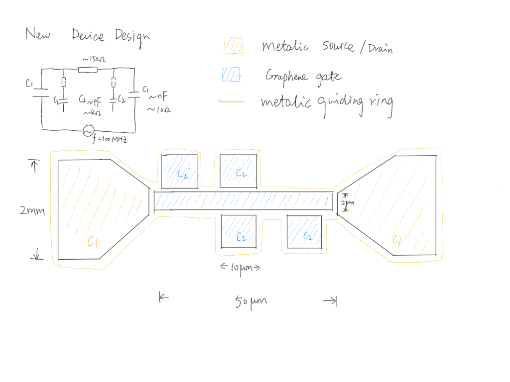
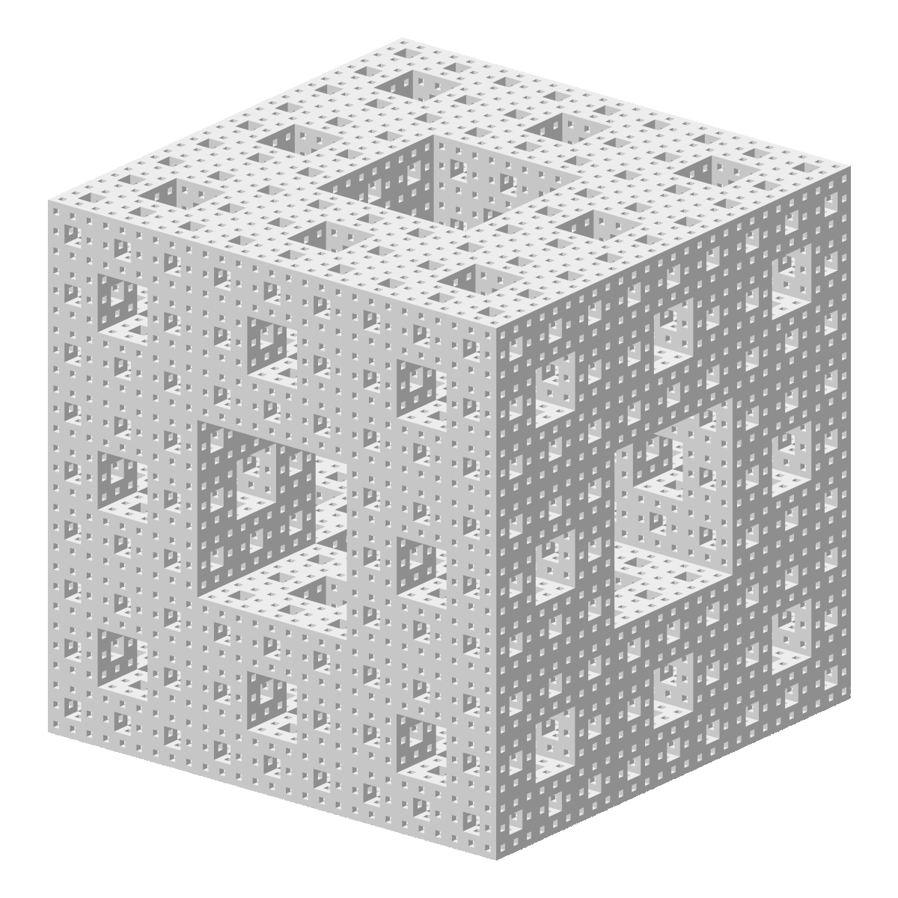

This site belongs to Jing-Jin Hu (胡京津) , a young condensed-matter physicist. She is currently in <a href="http://www.phy.pku.edu.cn/~xilin/index.html"> Prof. Xi Lin's group</a> at Peking University.

<h1><a name="ResearchInterest">Research Interests</a></h1>
* Low temperature electronic transport;
* Novel material.

<h1><a name="Projects">Projects</a></h1>

## Current Projects

<a href="projects/2DEG">
	
	 2D electron gas (2DEG) on liquid Helium.
</a>

<a href="projects/factal">
	
	 Electronic transport in factal structures.
</a>

## Previous Projects

* 1.8K refrigerator. 

<h1>Building Blog</h1>
  <ul class="posts">
    
      <li>{{ post.date | date_to_string }} &raquo; <a href="{{ site.baseurl }}{{ post.url }}">{{ post.title }}</a></li>
    
  </ul>